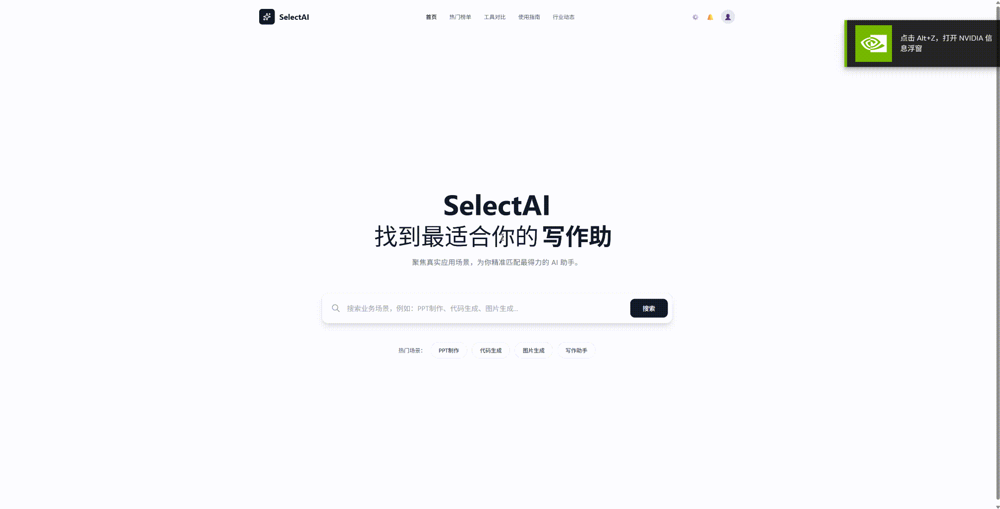

# SelectAI - AI 工具选择平台

> 聚焦真实应用场景，为你精准匹配最得力的 AI 助手

SelectAI 是一个专业的 AI 产品评测和推荐平台，旨在帮助普通用户在不同垂直业务场景下，找到最合适、最强大的 AI 工具。我们通过科学的评测方法，展示不同 AI 能力的上下限范围和边界，让您清楚了解每个 AI 产品的优势和适用场景。


## 📸 项目演示



> 💡 **提示**：如果 GIF 未显示，请确保将 `demo.gif` 文件放在项目根目录下，或使用 GitHub 仓库中的相对路径。

## ✨ 核心特性

### 🎯 场景化推荐
- **垂直业务场景**：针对 PPT制作、代码生成、图片生成、写作助手、视频编辑等具体场景
- **TOP3 推荐**：每个场景精选 TOP3 AI 工具，节省选择时间
- **智能搜索**：支持关键词搜索，快速找到相关场景

### 📊 详细信息展示
- **产品对比**：清晰展示每个工具的平台链接、是否免费、开发商、VPN要求等
- **Prompt 模板**：提供可直接使用的 Prompt 模板，一键复制
- **最佳实践**：详细的使用技巧和建议，帮助您快速上手

### 🎨 现代化设计
- **极简风格**：采用 Vercel/Notion 风格的极简设计，高冷、留白、通透
- **响应式布局**：完美适配桌面端和移动端
- **精致交互**：打字机动画、手风琴组件、IDE 风格代码展示

## 🚀 快速开始

### 环境要求

- Node.js >= 16.0.0
- npm >= 7.0.0

### 安装依赖

```bash
npm install
```

### 启动开发服务器

```bash
npm run dev
```

访问 http://localhost:5173 查看应用

### 构建生产版本

```bash
npm run build
```

### 预览生产构建

```bash
npm run preview
```

## 📁 项目结构

```
SelectAI/
├── src/
│   ├── pages/
│   │   ├── Home.tsx          # 首页组件
│   │   └── SceneDetail.tsx   # 场景详情页组件
│   ├── data/
│   │   └── mockData.ts       # Mock数据
│   ├── App.tsx               # 主应用组件
│   ├── main.tsx              # 入口文件
│   └── index.css             # 全局样式
├── index.html                # HTML模板
├── package.json              # 项目配置
├── tailwind.config.js        # Tailwind配置
├── tsconfig.json             # TypeScript配置
└── vite.config.ts            # Vite配置
```

## 🛠️ 技术栈

- **前端框架**: React 18
- **类型系统**: TypeScript
- **构建工具**: Vite
- **样式方案**: Tailwind CSS
- **路由管理**: React Router v6
- **图标库**: Lucide React
- **动画库**: react-type-animation

## 📱 功能模块

### 首页 (Home)
- **搜索功能**：中心搜索框，支持实时搜索建议
- **打字机动画**：动态展示不同 AI 工具类型
- **热门场景**：快速访问常用场景

### 场景详情页 (SceneDetail)
- **产品卡片**：左中右布局，展示排名、产品信息、行动按钮
- **元数据标签**：精美的标签展示（免费/付费、Web、VPN要求等）
- **Prompt 模板**：IDE 风格的代码编辑器展示
- **最佳实践**：清单式展示使用技巧

## 🎨 设计特点

### 视觉设计
- **极简主义**：黑白灰配色，高冷专业
- **精致细节**：双重边界、柔和阴影、macOS 风格窗口控制
- **信息层次**：清晰的信息架构，易于阅读

### 交互设计
- **响应式布局**：桌面端双栏展示，移动端折叠优化
- **微交互**：打字机动画、hover 效果、过渡动画
- **信息直达**：桌面端内容直接展示，无需点击展开

## 📝 当前支持场景

1. **PPT制作** - Gamma, Beautiful.ai, Tome
2. **代码生成** - Cursor, GitHub Copilot, Codeium
3. **图片生成** - Midjourney, DALL-E 3, Stable Diffusion
4. **写作助手** - Claude, Notion AI, Grammarly
5. **视频编辑** - Runway, 剪映, Descript

## 🔮 未来计划

- [ ] 添加更多业务场景
- [ ] 实现用户评价和评分系统
- [ ] 添加 AI 产品对比功能
- [ ] 实现收藏和分享功能
- [ ] 添加更多交互式教程
- [ ] 支持多语言
- [ ] 接入真实 API 数据

## 🤝 贡献

欢迎提交 Issue 和 Pull Request！

## 📄 许可证

MIT License

## 👨‍💻 作者

SelectAI Team

---

**SelectAI** - 让 AI 真正成为您生活、职场、学习中的得力助手 ✨
